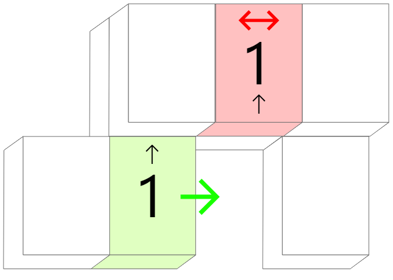
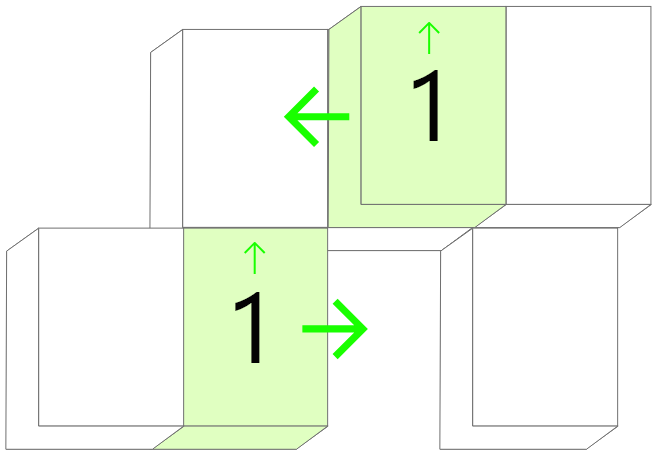
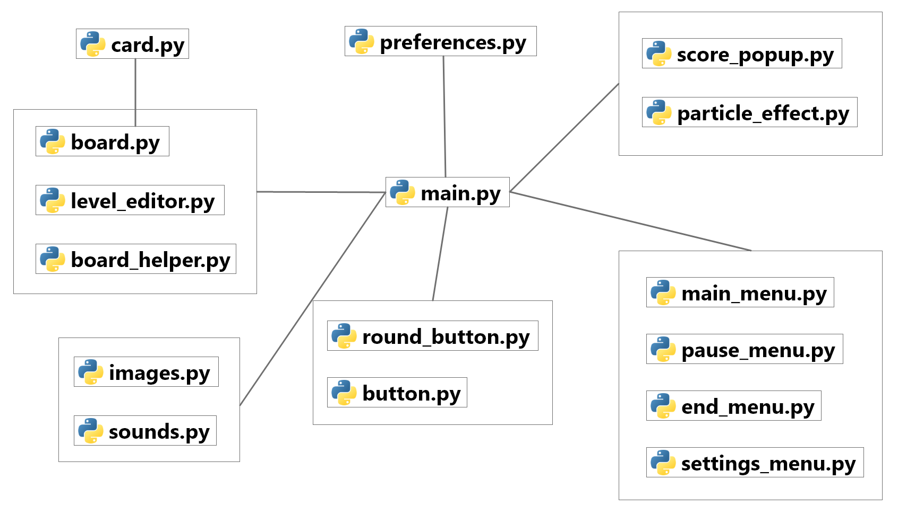
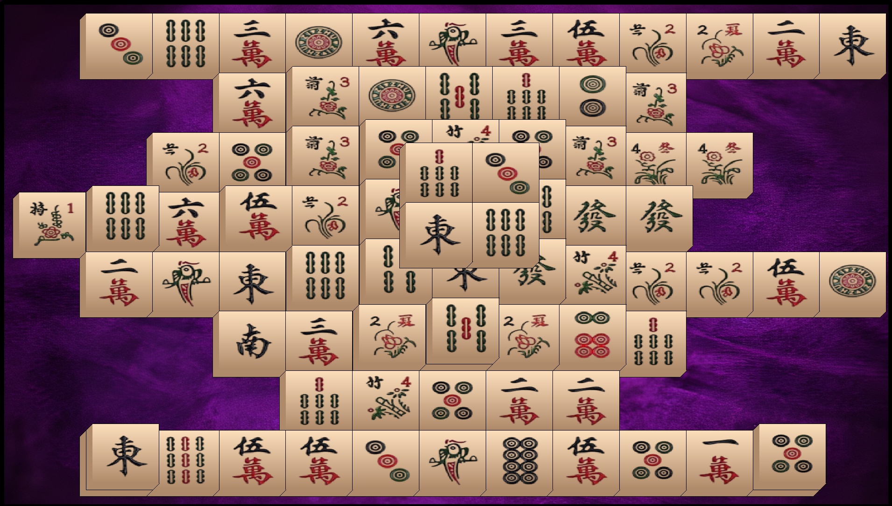

<h1 style="text-align: center;">Projet Info L2 - Shanghai Mahjong</h1>
<h3 style="text-align: center;"> Mathéo LÉVÊQUE</h3>

<hr>

## I) Introduction

Le **Shanghai Mahjong** (ou *Majhong Solitaire*) est un célèbre jeu vidéo développé dans les années 1980 par Activision. Initialement tiré du Mahjong classique, un jeu de société d'origine chinoise qui se joue à plusieurs avec des règles complexes, le Shanghai Mahjong est une version simplifiée qui se joue en solitaire. Il existe de nombreuses variantes et de versions différentes qui ont été développées depuis la création et la popularisation du jeu avec des règles qui peuvent légèrement différer selon les versions.
Le jeu est composé d'un plateau sur lequel on dispose (en empilant ou bien sur les côtés) des tuiles avec des motifs différents : l'objectif est de vider le plateau en retirant toutes les tuiles. Il est uniquement possible de retirer des tuiles par paires de tuiles identiques. De plus, une tuile ne peut être retirée que si elle ne possède pas de tuiles au-dessus d'elle ni à sa droite ou à sa gauche comme le montre les schémas suivants :

<div align="center">
    <table style="border: none;">
        <tr>
            <td align="center" style="border: none;">
                <h5 style="margin-bottom: 5px;">Retrait impossible</h5>
                
            </td>
            <td align="center" style="border: none;">
                <h5 style="margin-bottom: 5px;">Retrait possible</h5>
                
            </td>
        </tr>
    </table>
</div>

Lorsque le jeu détecte qu'il n'est plus possible de trouver une paire valide de tuiles à retirer, une permutation aléatoire des positions des tuiles est effectuée jusqu'à ce qu'un retrait valide soit de nouveau possible.
La taille de la grille de départ, le nombre de tuiles au début de la partie ou encore le nombre d'étages sont des paramètres qui peuvent varier.

## II) Implémentation et Fonctionnalités

Pour réaliser ce projet, j'ai choisi d'utiliser le langage **Python** et plus particulièrement la librairie **Pygame** qui permet de concevoir des jeux vidéos et des interfaces graphiques interactives. J'ai opté pour ce choix dès le départ puisque Pygame s'adapte plutôt bien pour concevoir des jeux de plateau simples en 2D mais également construire des menus et interfaces graphiques. 
Au terme de la phase de développement du jeu, j'ai réussi à remplir l'ensemble des objectifs et des fonctionnalités qui étaient fixées au début du projet ainsi qu'en apporter de nouvelles. À savoir :

| Fonctionnalités |
|-----------------|
| • Lancer une partie de Shanghai Mahjong sur un plateau de taille variable |
| • Charger une partie depuis un fichier |
| • Sauvegarder une partie en cours dans un fichier |
| • Générer aléatoirement une nouvelle grille de jeu |
| • Gérer un système de score avec un système de combos et de bonus |
| • Créer et sauvegarder des niveaux personnalisés via un éditeur de niveaux |
| • Permettre au joueur de modifier les paramètres et les sauvegarder |
| • Gérer les effets sonores / musique |
| • Activer une option de "triche" qui met en surbrillance une paire de tuiles jouables |
| • Activer un mode auto-solveur jouant automatiquement la partie |


En ce qui concerne l'architecture générale du projet, elle est divisée en **16 fichiers** python `.py` qui contiennent chacun une classe associée. On peut les diviser en plusieurs parties :
1. Gestion de la partie et du plateau de jeu
2. Gestion des menus
3. Gestion des images / sons
4. Gestion des autres éléments graphiques (boutons...)


<div align="center">
    <table style="border: none;">
        <tr>
            <td align="center" style="border: none;">
                <h5 style="margin-bottom: 5px;">Architecture du Projet</h5>
                
            </td>
        </tr>
    </table>
</div>

- Le fichier `main.py` correspond au programme principal contenant la classe `Game` qui gère la boucle de jeu. Au démarrage du jeu, elle charge et redimensionne toute les images, en plus des sons. Tous les menus de l'application sont également initialisés et instanciés au démarrage. 
C'est cette classe qui décide quelle "scène" actualiser et afficher en fonction du `GameState`.
- Les fichiers `main_menu.py`, `pause_menu.py`, `end_menu.py` et `settings_menu.py` sont les différents menus du jeu. Ils disposent tous d'une méthode <span style="color:darkblue;">update</span>() et <span style="color:darkblue;">draw</span>() au même titre que toutes les "entités graphiques" du programme. Chaque menu possède également d'une liste de boutons (`button.py` et `round_button.py`) qui déclenchent des actions lorsqu'ils sont cliqués par l'utilisateur.
- Les fichiers `board.py` et `level_editor.py` gèrent respectivement la partie de Mahjong en elle-même et l'éditeur de niveau. La classe `Board` contient toute la logique de la partie et gère l'affichage du plateau de jeu ainsi que de toutes les cartes (`card.py`). Le fichier `board_helper` fournit des fonctions utiles et communes aux deux classes précédentes comme exporter l'état d'une partie dans un fichier ou bien charger un niveau depuis un fichier.
- Les fichiers `images.py` et `sounds.py` permettent de charger et d'initialiser les images et les sons / musiques qui sont utilisés dans le jeu. Des méthodes permettent également de redimensionner les images pour s'adapter à la taille de la fenêtre de l'application.
- Le fichier `preferences.py` permet de gérer les paramètres globaux et la lecture / écriture dans le fichier JSON qui assure la persistance des données (activation de la musique et taille de la grille de jeu).
- Les fichiers `score_popup.py` et `particle_effect.py` agissent comme des animations qui sont lancées dans le `Board` lorsqu'une paire de tuiles est retirée.

## III) Difficultés rencontrées

-   ### A) Affichage du jeu

    La première difficulté du projet était d'arriver à trouver un moyen de représenter le plateau de jeu et l'empilement des tuiles de manière claire et lisible pour le joueur. En effet, il est nécessaire de donner un effet de profondeur et de perspective afin de créer un "effet 3D" puisqu'il y a plusieurs niveaux de tuiles à afficher à l'écran.
    J'ai choisi de représenter une tuile de Mahjong comme un pavé droit de perspective avec une face principale sur laquelle est affichée l'image et des contours qui donnent un effet de profondeur. Pour donner un effet d'empilement, chaque étage de tuiles est décalé d'un **offset** fixe en haut à droite en fonction de l'étage sur lequel se situe la tuile.

    <div align="center">
        <table style="border: none;">
            <tr>
                <td align="center" style="border: none;">
                    
                    <h5 style="margin-bottom: 5px;">Plateau de jeu</h5>
                </td>
            </tr>
        </table>
    </div>

    On remarque également que le dernier étage de tuiles est décalé et n'est pas superposé avec ceux du dessous, ce qui rajoute un cas particulier à prendre en compte pour la gestion et l'affichage des tuiles.<br> 
    Pour les images des tuiles, j'ai utilisé une planche de cartes de Mahjong que j'ai trouvé en ligne et que j'ai détouré afin de les incorporer dans le jeu, ce qui donne un total de 38 types de tuiles différents.

-   ### B) Gestion du plateau de jeu - Import / Export

    Le plateau de jeu est stocké et représenté dans la classe `Board` par un tableau à 3 dimensions qui contient la liste des tableaux 2D de tuiles pour chaque étage. Une tuile est donc représentée par son type (de 1 à 38) et ses coordonnées x, y et z dans la grille de jeu. Sa position effective dans la fenêtre du jeu est calculée à partir de ses coordonnées en prenant en compte l'offset pour chaque étage et la taille des tuiles de la manière suivante :
    <div style="font-size: 0.8em">

    ```python
    self.coord_x = self.board.width_start + self.cell_x * self.board.card_width + self.level * self.offset
    self.coord_y = self.board.height_start + self.cell_y * self.board.card_height - self.level * self.offset
    ```

    </div>

    J'ai également réalisé une fonctionnalité permettant d'exporter et d'importer des parties de Mahjong depuis (ou vers) un fichier texte. Le format est simple, les tuiles sont représentées par leur type respectif (entier de 1 à 38) et chaque étage est séparé d'un saut de ligne.

    <div style="font-size: 0.9em">

    ```
    0 1 2 1 1 1 1 1 0
    1 1 1 1 1 1 1 1 1
    1 1 2 1 1 1 1 1 1

    0 0 6 7 8 1 2 2 0
    0 1 1 1 1 1 4 19 0
    0 12 16 1 8 1 30 0 0

    1 0 8 17 0 23 0 30
    0 0 10 0 4 0 0 0
    ```
    La fichier `board_helper` fournit deux fonctions <span style="color:darkblue;">load_from_file</span>() et <span style="color:darkblue;">export_to_file</span>() permettant de réaliser ces deux opérations.

    </div>

-   ### C) Gestion des menus

    

